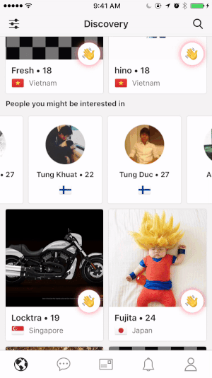

# DTButtonMenuController
[](http://cocoapods.org/pods/DTButtonMenuController)
[](http://cocoapods.org/pods/DTButtonMenuController)
[](http://cocoapods.org/pods/DTButtonMenuController)

## Example


DTButtonMenuController is extremely easy to use. For minimal intergration in your project, here is what you need to do:

```
let viewController = DTButtonMenuController(highlightedView: view)
itemSize = CGSize(width: 50, height: 50)
itemsDistanceToTouchPoint = 100

// Add five item buttons into controller
for _ in 0...4 {
	let item = DTMenuButton(completionHandlerBlock: { (button: DTMenuButton) in
    		
         })
     })
            
    // Extra configuration for item button, e.g backgroundColor, image, rounded corner
            
    // Add item button to controller
    viewController.addItem(item)
}

present(viewController, animated: true, completion: nil)
```

In common cases, you will not use DTButtonMenuController but subclass it and make your own controller. 

## Requirements

## Installation

DTButtonMenuController is available through [CocoaPods](http://cocoapods.org). To install
it, simply add the following line to your Podfile:

```ruby
pod "DTButtonMenuController"
```

## Author

Tung Vo, tung98.dn@gmail.com

## License

DTButtonMenuController is available under the MIT license. See the LICENSE file for more info.
